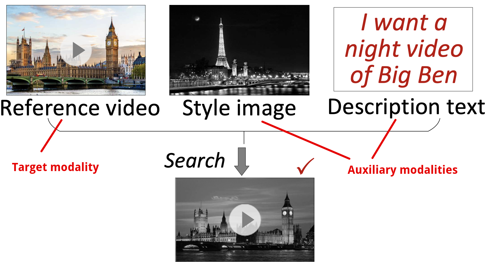

# MUST: An Effective and Scalable Framework for Multimodal Search with Target Modality
## 1. Introduction

We introduce a new research problem: multimodal search with target modality. This problem involves searching for objects in one modality (the target) using multiple modalities as input. One of the input modalities is the target modality, and the others are the auxiliary modalities. The auxiliary modalities modify or refine some aspects of the target modality input. For example, we can search for videos using a reference video and auxiliary image and text. Our paper entitled “MUST: An Effective and Scalable Framework for Multimodal Search with Target Modaliy” provides an efficient and scalable framework for `mu`ltimodal `s`earch with `t`arget modality, called MUST. The evaluation results demonstrate that MUST improves search accuracy by about 50%, is more than 10x faster than the baseline methods, and can scale to more than 10 million data size.



This repo contains the code, datasets, optimal parameters, and other detailed information used for the experiments of our paper.

## 2. Baseline

* Multi-streamed retrieval (MR). MR is a traditional strategy for solving hybrid queries in IR and DB communities [[VLDB'20](https://dl.acm.org/doi/10.14778/3415478.3415541), [SIGMOD'21](https://dl.acm.org/doi/10.1145/3448016.3457550)]. We adapt this framework to handle MSTM problem and enhance it by using advanced unimodal and multimodal encoders like CLIP [[CVPR'22](https://openaccess.thecvf.com/content/CVPR2022W/ODRUM/papers/Baldrati_Conditioned_and_Composed_Image_Retrieval_Combining_and_Partially_Fine-Tuning_CLIP-Based_CVPRW_2022_paper.pdf)].

* Joint embedding (JE). JE is a mainstream method for addressing multimodal search in CV community. We use two representative multimodal encoders: TIRG (pioneer) [[CVPR'19](https://openaccess.thecvf.com/content_CVPR_2019/papers/Vo_Composing_Text_and_Image_for_Image_Retrieval_-_an_Empirical_CVPR_2019_paper.pdf)] and CLIP (SOTA) [[CVPR'22](https://openaccess.thecvf.com/content/CVPR2022W/ODRUM/papers/Baldrati_Conditioned_and_Composed_Image_Retrieval_Combining_and_Partially_Fine-Tuning_CLIP-Based_CVPRW_2022_paper.pdf)].

## 3. MUST Overview

In MUST, we use three pluggable components: (1) Embedding; (2) Vector weight learning; (3) Indexing and search.


## 4. Datasets

| Dataset                                                      | # Modality | # Object   | # Query | Type          | Source         |
| ------------------------------------------------------------ | ---------- | ---------- | ------- | ------------- | -------------- |
| CelebA ([link](https://mmlab.ie.cuhk.edu.hk/projects/CelebA.html)) | 2          | 191,549    | 34,326  | Image; Text   | real-world     |
| MIT-States ([link](http://web.mit.edu/phillipi/Public/states_and_transformations/index.html)) | 2          | 53,743     | 72,732  | Image; Text   | real-world     |
| Shopping*                                                    | 2          | 96,009     | 47,658  | Image; Text   | real-world     |
| CelebA+ ([link](https://mmlab.ie.cuhk.edu.hk/projects/CelebA.html)) | 4          | 191,549    | 34,326  | Imagex3; Text | real-world     |
| ImageText1M ([link](http://corpus-texmex.irisa.fr/))         | 2          | 1,000,000  | 1,000   | Image; Text   | semi-synthetic |
| AudioText1M ([link](http://www.ifs.tuwien.ac.at/mir/msd/download.html)) | 2          | 992,272    | 200     | Audio; Text   | semi-synthetic |
| VideoText1M ([link](https://drive.google.com/file/d/1HIdQSKGh7cfC7TnRvrA2dnkHBNkVHGsF/view)) | 2          | 1,000,000  | 10,000  | Video; Text   | semi-synthetic |
| ImageText16M ([link](https://big-ann-benchmarks.com/))       | 2          | 16,000,000 | 10,000  | Image; Text   | semi-synthetic |

*Please contact [the author of the dataset](https://sites.google.com/view/kenanemirak/home) to get access to the images.

## 5. Parameters

To obtain embedding vectors, we use the same training hyper-parameters as the original papers of encoders. The encoder configuration is the same for all three frameworks. For the vector weight learning module, we set the learning rate to 0.2 and train for 20 iterations by default. Appendix contains the analysis of other parameters and the output weights of module on different datasets.

## 6. Usage

### (1) Prerequistes

```shell
PyTorch
Pybind
GCC 4.9+ with OpenMP
CMake 2.8+
```

### (2) Run

(i) Embedding

Refer to [TIRG](https://github.com/google/tirg) and [CLIP](https://github.com/ABaldrati/CLIP4CirDemo).

We convert vectors of all objects and query inputs to `fvecs` format or `ivecs` format, and groundtruth data to `ivecs` format. For the description of `fvecs` and `ivecs` format, see [here](http://yael.gforge.inria.fr/file_format.html).

(ii) Vector weight learning

```shell
cd ./vector_weight_learning
python setup.py install
python main.py
```

(iii) Indexing and search

```shell
cd ./scripts
./run release build_<framework> # index build
./run release search_<framework> # search
```

## 7. Demo


## 8. Acknowledgements

We used the implementation of our embedding from [TIRG](https://github.com/google/tirg) and [CLIP](https://github.com/ABaldrati/CLIP4CirDemo). We implemented our indexing components and search codes based on [CGraph](https://github.com/ChunelFeng/CGraph). We appreciate their inspiration and the references provided for this project.
