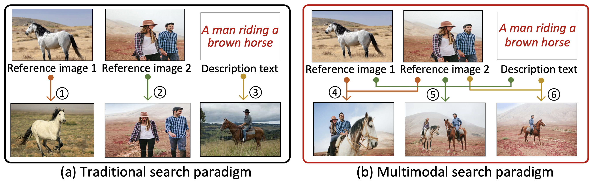
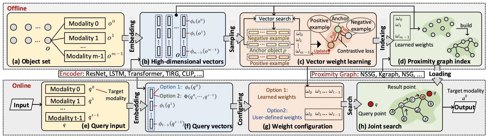
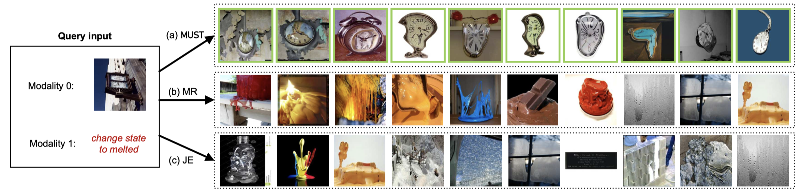

# MUST: An Effective and Scalable Framework for Multimodal Search of Target Modality
## 1. Introduction

We investigate a specific variant of multimodal search called "multimodal search of target modality". This problem involves enhancing a query in a specific target modality (such as video) by incorporating information from auxiliary modalities (such as text). The objective is to retrieve relevant objects whose content in the target modality aligns with the specified multimodal query. For example, we can search for images by using a reference image along with an auxiliary image and text. In our paper titled "MUST: An Effective and Scalable Framework for Multimodal Search of Target Modality," we present an efficient and scalable framework for **Mu**ltimodal **S**earch of **T**arget Modality, called MUST. The evaluation results demonstrate that MUST significantly improves search accuracy, achieving an average improvement of 93% compared to baseline methods. Furthermore, it outperforms the baseline methods in terms of speed, being more than 10 times faster. Additionally, MUST showcases its ability to scale to datasets with sizes exceeding 10 million records.



This repo contains the code, datasets, optimal parameters, and other relevant details utilized in the experiments.

## 2. Baseline

* Multi-streamed retrieval (MR). MR is a traditional strategy for solving hybrid queries in IR and DB communities [[VLDB'20](https://dl.acm.org/doi/10.14778/3415478.3415541), [SIGMOD'21](https://dl.acm.org/doi/10.1145/3448016.3457550)]. We adapt this framework to handle the MSTM problem and enhance it by incorporating advanced unimodal and multimodal encoders, such as CLIP [[CVPR'22](https://openaccess.thecvf.com/content/CVPR2022W/ODRUM/papers/Baldrati_Conditioned_and_Composed_Image_Retrieval_Combining_and_Partially_Fine-Tuning_CLIP-Based_CVPRW_2022_paper.pdf)].

* Joint embedding (JE). JE is a mainstream method for addressing multimodal fusion in CV community. We use three representative multimodal encoders: TIRG [[CVPR'19](https://openaccess.thecvf.com/content_CVPR_2019/papers/Vo_Composing_Text_and_Image_for_Image_Retrieval_-_an_Empirical_CVPR_2019_paper.pdf)], CLIP [[CVPR'22](https://openaccess.thecvf.com/content/CVPR2022W/ODRUM/papers/Baldrati_Conditioned_and_Composed_Image_Retrieval_Combining_and_Partially_Fine-Tuning_CLIP-Based_CVPRW_2022_paper.pdf)], and MPC[[CVPR'22](https://openaccess.thecvf.com/content/CVPR2022W/MULA/html/Neculai_Probabilistic_Compositional_Embeddings_for_Multimodal_Image_Retrieval_CVPRW_2022_paper.html)].

## 3. MUST Overview

In MUST, we design three pluggable components: (1) Embedding; (2) Vector weight learning; (3) Indexing and searching.



## 4. Datasets

| Dataset                                                      | # Modality | # Object   | # Query | Type          | Source         |
| ------------------------------------------------------------ | ---------- | ---------- | ------- | ------------- | -------------- |
| CelebA ([link](https://mmlab.ie.cuhk.edu.hk/projects/CelebA.html)) | 2          | 191,549    | 34,326  | Image; Text   | real-world     |
| MIT-States ([link](http://web.mit.edu/phillipi/Public/states_and_transformations/index.html)) | 2          | 53,743     | 72,732  | Image; Text   | real-world     |
| Shopping*                                                    | 2          | 96,009     | 47,658  | Image; Text   | real-world     |
| MS-COCO([link](https://cocodataset.org/#download))           | 3          | 19,711     | 1237    | Imagex2; Text | real-world     |
| CelebA+ ([link](https://mmlab.ie.cuhk.edu.hk/projects/CelebA.html)) | 4          | 191,549    | 34,326  | Imagex3; Text | real-world     |
| ImageText1M ([link](http://corpus-texmex.irisa.fr/))         | 2          | 1,000,000  | 1,000   | Image; Text   | semi-synthetic |
| AudioText1M ([link](http://www.ifs.tuwien.ac.at/mir/msd/download.html)) | 2          | 992,272    | 200     | Audio; Text   | semi-synthetic |
| VideoText1M ([link](https://drive.google.com/file/d/1HIdQSKGh7cfC7TnRvrA2dnkHBNkVHGsF/view)) | 2          | 1,000,000  | 10,000  | Video; Text   | semi-synthetic |
| ImageText16M ([link](https://big-ann-benchmarks.com/))       | 2          | 16,000,000 | 10,000  | Image; Text   | semi-synthetic |

*Please contact [the author of the dataset](https://sites.google.com/view/kenanemirak/home) to get access to the images.

## 5. Parameters

We obtain embedding vectors by utilizing the identical training hyperparameters as specified in the original papers of the encoders. The encoder configuration remains consistent across all three frameworks. Regarding the vector weight learning module, we set the default learning rate to 0.002 and conduct training for 700 iterations. For a comprehensive analysis of additional parameters and the output weights of the module on different datasets, please refer to the [appendix](https://github.com/ZJU-DAILY/MUST/tree/main/appendix).

## 6. Usage

### (1) Prerequistes

```shell
PyTorch
Pybind
GCC 4.9+ with OpenMP
CMake 2.8+
```

### (2) Run

(i) Embedding

Refer to [TIRG](https://github.com/google/tirg), [CLIP](https://github.com/ABaldrati/CLIP4CirDemo), and [MPC](https://github.com/andreineculai/MPC).

We convert vectors of all objects and query inputs to `fvecs` format or `ivecs` format, and ground-truth data to `ivecs` format. For the description of `fvecs` and `ivecs` format, see [here](http://yael.gforge.inria.fr/file_format.html).

(ii) Vector weight learning

```shell
cd ./vector_weight_learning
python setup.py install
python main.py
```

(iii) Indexing and searching

```shell
cd ./scripts
./run release build_<framework> # index build
./run release search_<framework> # search
```

## 7. Demo



## 8. Acknowledgements

We used the implementation of our embedding from [TIRG](https://github.com/google/tirg), [CLIP](https://github.com/ABaldrati/CLIP4CirDemo), and [MPC](https://github.com/andreineculai/MPC). We implemented our indexing components and search codes based on [CGraph](https://github.com/ChunelFeng/CGraph). We appreciate their inspiration and the references provided for this project.
